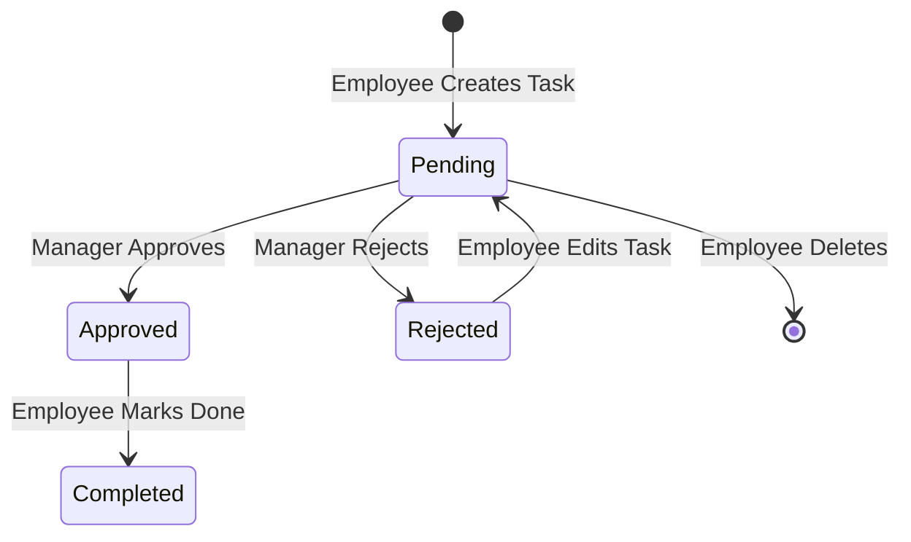

# Feature Ticket: ThumbsUp Task & Approval Manager

## 1. Project Overview
ThumbsUp is a high-efficiency collaborative task and approval management system designed for structured workflows within teams. It enforces accountability and distinct divisions of responsibility by separating tasks into four main states: **Pending**, **Approved**, **Rejected**, and **Completed**, governed by three corporate roles: **Employee**, **Manager**, and **Admin**.

The application features a sleek, minimal, high-energy modern corporate theme in Light and Dark mode, utilizing a Deep Orange (`#9E3D00` / `#FFB595`) accent to drive visual action.

---

## 2. Roles & Permissions Matrix

| Feature / Action | Employee | Manager | Admin | Notes |
| :--- | :---: | :---: | :---: | :--- |
| **View Personal Dashboard & Tasks** | Yes | Yes | Yes | Employees see their tasks; managers see team tasks; admins see platform stats. |
| **Create Task** | Yes | No | No | Employees submit tasks for approval. |
| **Edit/Delete Pending Task** | Yes | No | No | Only allowed for the creator, and only if status is `pending`. |
| **Review & Approve/Reject Tasks** | No | Yes | No | Only managers transition tasks from `pending` to `approved` or `rejected`. |
| **Mark Task Completed** | Yes | No | No | Only the employee creator marks their own `approved` task as `completed`. |
| **Manage Users & Role Assignment** | No | No | Yes | Admin can activate/suspend and change user roles. |
| **System Logs Audit** | No | No | Yes | Admin view of all logins, task updates, and email verifications. |
| **System Analytics Charts** | No | No | Yes | Admin view of task breakdown, monthly trends, and user growth. |

---

## 3. Workflow & Lifecycle

The lifecycle of a task moves through a strict state machine:

### Flow Descriptions:
1. **Creation**: An **Employee** creates a task with a title, description, priority (low, medium, high, critical), category tags, and a deadline.
2. **Review**: The task enters the **Pending** state and triggers a notification to the managers. The task is read-only for employees at this point, but they can delete it if no longer needed.
3. **Decision**:
   - **Approval**: If a **Manager** clicks **Approve**, the task status shifts to **Approved**.
   - **Rejection**: If a **Manager** clicks **Reject**, the status shifts to **Rejected** (with an optional rejection reason).
4. **Resolution**:
   - For **Approved** tasks: The **Employee** creator works on the task. Once finished, they click **Mark Complete**, shifting the state to **Completed**.
   - For **Rejected** tasks: The **Employee** creator can edit the task (e.g., correcting description/details), which automatically submits it back to the **Pending** state for review.

---

## 4. Feature Specifications

### 4.1 Authentication & Profile
- **Secure Registration & Login**: Validates name, email, and password strength. Email verification is enforced.
- **Theme Adaptability**: High-adaptability design toggles between Sleek Light (warm background) and Modern Dark (charcoal surface tones).
- **Profile Settings**: Users can update their names and change their passwords securely.

### 4.2 Task Management
- **Task List**: Features real-time filters (by status, priority, and text search), sorting by creation date/deadline, and pagination.
- **Task Details & Action Timeline**: Displays descriptions, tags, assignees, creators, deadlines, and a visual history timeline.
- **Notifications Hub**: Alerts users to actions (e.g., approvals, rejections, or re-submissions) with click-to-navigate links and mark-as-read options.

### 4.3 Admin Tools
- **User Directory**: List of all users showing emails, statuses (Active/Suspended), and last login timestamps. Enables inline role changes and suspending/reactivating accounts.
- **Analytics Dashboard**: Interactive Recharts displaying:
  - User growth over the last 6 months.
  - Task completion rates.
  - Category breakdowns.
- **System Activity Log**: Exportable CSV logs recording logins, registrations, status updates, and verification checks.
